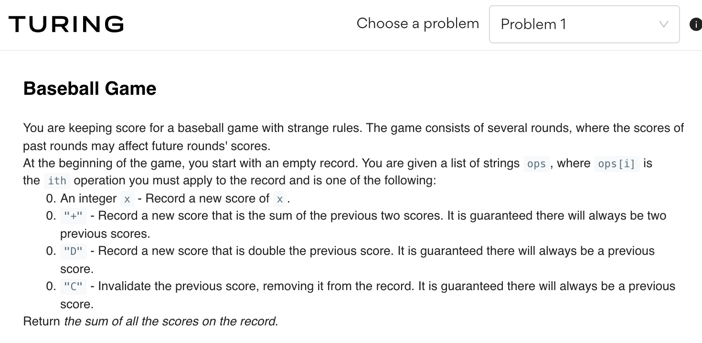
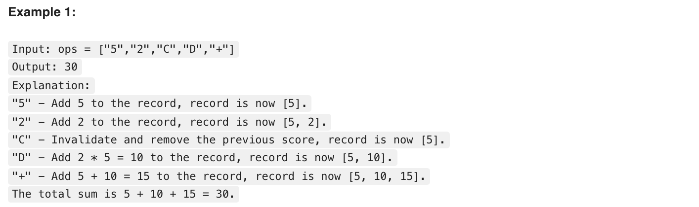
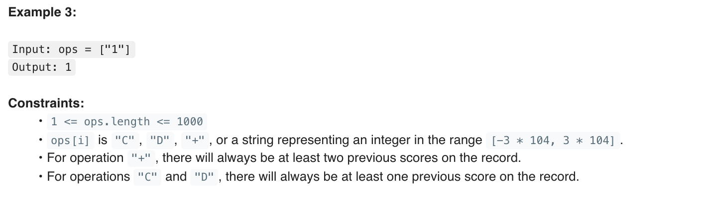
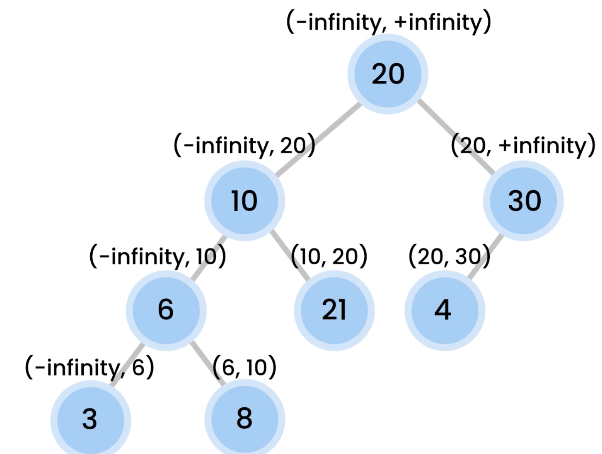
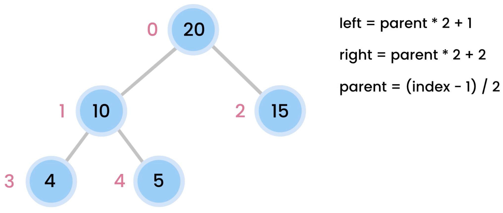
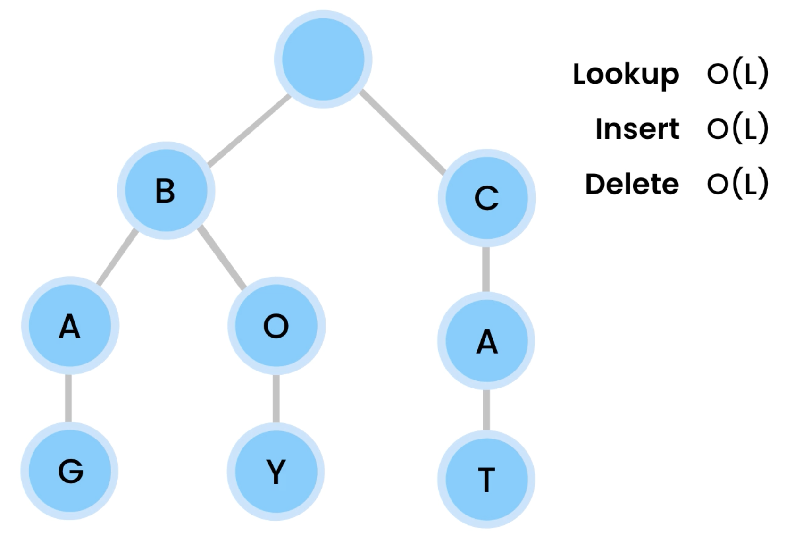

# Using Typescript.

- add files with .ts extension.
- typescript is installed globally in this computer.
- tsc --init added the tsconfig file.
- this is a broad project structure to explore different concepts, there is no standard src/ or dist/ for compiled code. Instead, add files into folders and run `tsc ../../file_path` and target the result compile with `node ../../file_path` to test and play.
- for instance, into data_structures/arrays: `tsc index.ts && node index.js`

# Using tests

- Jest framework is installed, for each file to be tested, add a new file with the same name `.test.js`
- you can run one specific test with `jest ../../file_path` or the global `npm run test` to run all the test in this directory.

# ESM vs 'ES6 Modules'

## Why modules need extension in node to import ES6?

This is because node.js follows the ES6 standard which forbids the interpreter from guessing filename extensions. You will also need to add file extensions if you want to use import in plain javascript in browsers. Typescript on the other hand was implemented based on the import syntax proposal before ES6 was finalized so they followed node module (commonjs) behavior which guesses file extensions. However when ES6 standard was finally published the real standard did not allow this. Node follows the real standard while typescript breaks the standard because the standard did not exist yet

DEFAULT MODULE IN NODE
`module.exports = Stack;` to use `const Stack = require('./..')`

ES6 MODULE IN NODE
Add "type": "module", in package.json
`export class Stack {}` to use `import { Stack } from './..';`

reference: https://stackoverflow.com/questions/38296667/getting-unexpected-token-export
If you are using NodeJS v14.13.0 or newer (which does support ESM) - - you can enable it by setting "type":"module" in your project package.json

- Refactor with CommonJS Module syntax (for older versions of NodeJS)
- Consider using TypeScript alongside ts-node or ts-node-dev npm packages (for instant transpilation at development time) and write TypeScript in .ts files
- Transpile ESM to CommonJS using esbuild (esbuild package on npm) configured to transpile your ES6 javascript to a CommonJS target supported by your environment. (babel is no longer recommended)

#### Typescript - ES6 and CommonJS

- Use case: Basically I need to be able to write TypeScript code in my IDE (this introduces great ease to development), compile it to ES6 and then apply babel.js (as all browsers doesn't support most ES6) to get the resulting ES5 scripts.
- i want to configure my tsconfig to transpile in ES6
- Then apply a bable to compile in ES5 - CommonJS.

- This project has a conflict with the ts portion of linear/array
- the transpilation is throwing commonJS.
- deprioritzed this config as in a real project you stick with one side.

### ES6

```
myClass.js
    export class MyClass1 {}
    export class MyClass2 {}


other.js
    import { MyClass1, MyClass2 } from './myClass';
```

### CommonJS Alternative

```
myClass.js
    class MyClass1 {}
    class MyClass2 {}
    module.exports = { MyClass1, MyClass2 }
    // or
    // exports = { MyClass1, MyClass2 };


other.js
    const { MyClass1, MyClass2 } = require('./myClass');
```

# What you can find

## Turing Challenges






### Coding challenge number 2.

find the shortest distance between 2 points.

function(distance, start, end)
something about distance total == distance[i] + distance[i + 1]%n

examples:

```
start           end
 *              *
(0) --- 1 ---> (1) ---- 2 ---> (2) ---- 3 --- (3) ---- 4 ---> (4)

distances = [1,2,3,4]
start= 0 (resting point)
end= 1 (resting point)
clockWise = 1
counterClockWise = 9
answer = 1.


start                           end
 *                              *
(0) --- 1 ---> (1) ---- 2 ---> (2) ---- 3 --- (3) ---- 4 ---> (4)

distances = [1,2,3,4]
start= 0 (resting point)
end= 2 (resting point)
clockWise = 3
counterClockWise = 7
answer = 3.

----------------------

start                                          end
 *                                             *
(0) --- 1 ---> (1) ---- 2 ---> (2) ---- 3 --- (3) ---- 4 ---> (4)
distances = [1,2,3,4]
start= 0
end= 3

clockWise = 6
counterClockWise = 4

answer = 4.

```

## Data Structures

#### BST - Binary Search Tree

Using recursion, you can validate each node in the left is < than root.
and each node in the right is > than root
instad of multiple traverse in each root.
you can better limit ranges for comparison in each level of the tree.


TRAVERSAL

- BREADTH FIRST -- LEVEL ORDER
  Visit all the nodes at the same level before moving to the next level
- DEPTH FIRST
  Pre-order: ROOT, Left Right
  In-order: Left, ROOT, Right
  Post-order: Left, Right, ROOT

#### AVL Tree

AVL tree (named after inventors Adelson-Velsky and Landis) is a self-balancing binary search tree. In an AVL tree, the heights of the two child subtrees of any node differ by at most one; if at any time they differ by more than one, rebalancing is done to restore this property.

visualiation too: https://www.cs.usfca.edu/~galles/visualization/AVLtree.html

#### Rotations

    About Rotations.
    you find the balance factor, if the unbalance in the root is -1 (balance factor right heavy)
    here we know we are dealing with this shape:
    ```
    10 - root.
      20 - balance factor = (-1) (which mean Right Heavy)
        30
    ```

    here we need to do a LeftRotate

    another case, if the unbalance of the root is 1 (balance factor left heavy)
    here we know we are dealing with this shape:
    ```
    10 - root.
      30 - balance factor = (1) (which mean Left Heavy)
    20
    ```
    here we need to do a RightRotate, followed by a LeftRotate.

#### Performing Left Rotation sample

Imagine a Right heavy tree. Performing a "Left Rotation"

```
10 root
   20 (new root)
x?    30 leaf

the result should look like this:
   20 new root
10    30
   x?
```

its important to check if 20 had already a x? left child.
if so, new root.left child pass to be be the old root
new root lef =

operations would look like this:

- newRoot = root.right (make 20 the new root)
  -- root.right = newRoot.left (any left child of the new root will pass down to be right child of the old root)
- newRoot.left = root ( pass 10 to the left child of 20 )

- Reset height of root/newRoot
  at this point the hight has changed
  we need to reset height and reasign new root

#### Performing Right Rotation sample

Imagine

```
10 (old root)
    30
20  (new root)
```

newRoot = [paseed:oldRoot.right].left
[paseed:oldRoot.right].left = null // reset
newRoot.right = [paseed:oldRoot]
return newRoot // to be added as: oldRoot.right = newRoot

```
    20
10      30

```

## Heaps

```
Non linear data structures
Heaps are BT (binary trees) that feed level by level from left to right.
    - entries are from left to right
    - heap property: every value in the upper level is greater than children levels.
    - max heap: the root node with the greates value
    - min heap: the leaf node with the smallest value
    - a complete heap is what satisfies all the above properties

Applications in real world:
    - sorting data, (HeapSort)
    - Graph algorithms (shortest path) - used in maps
    - Priority Queues
    - Finding the Kth smallest or largest value

Operations and runtime complexity
    - bubleup operation: for every insert, move to position level to be greater if needed.
    - the longest it can traverse in bubble up is the height of the tree.
    - runtime is O(log n) => O(h), because each iteration is removing half of the posibilites as its binary (binary tree)

- Delete nodes:
    you can only remove the root node, not the inner nodes.
    for every delete, some bubble up and down need to be performed to arrange the heap again.
    the inner nodes to move are the last leaf node from left to right (taking the right one)
    deleting also runs in O(log n).


```

Implementing a heap with an array, using index for reference to the nodes


## Tries

Tries are trees (not binary) and their use case is autocompletion


Since the alphabet has 27 letters, each node can have up to 26 children,
this to map all possible prefix for a autocomplete functionality

# Javascript notes

- Think of time and space performance for every operation, also think of implications for using in the browser.
- not all code is within Node or backend engine boundaries, the browser computation may affect the performance as well.
